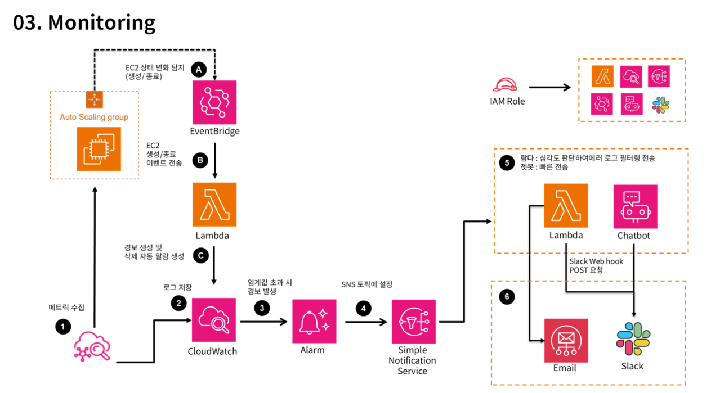
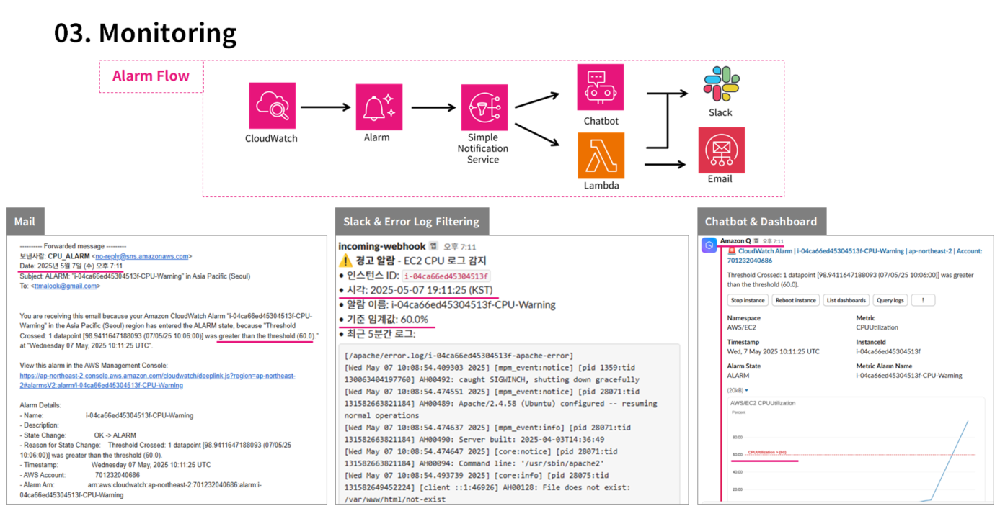

# AWS EC2 모니터링 자동화를 위한 구성 예시



이 저장소는 AWS 환경에서 EC2 인스턴스 상태 및 리소스 사용량(CPU 등)을 자동 감시하고,
Slack 등으로 알림을 전송하는 구조를 Lambda 기반으로 구성한 예제입니다.

## 📁 구성 디렉토리

- /scripts: Lambda 함수 스크립트
- /configs: CloudWatch Agent 설정 파일
- /tests: 실제 부하 유도 및 로그 유도 테스트 스크립트
- /images: 시스템 구성도 및 알람 흐름 예시 이미지

---

## ✅ Lambda 함수 설명

### 1. lambda_cpu_alert.py
- CloudWatch 알람 발생 시 SNS로 트리거
- 알람 대상 인스턴스의 Apache, Syslog 로그 조회
- 최근 5분간 로그를 Slack으로 전송

### 2. lambda_instance_detector.py
- EC2 인스턴스 상태 변경 감지 (생성, 종료)
- 인스턴스별 CPU 알람을 자동 생성 또는 삭제
- IAM Role이 연결되지 않은 경우 자동 연결 시도

---

## ⚙️ CloudWatch Agent 설정 (configs/amazon-cloudwatch-agent.json)

- 수집 메트릭:
  - CPU: idle, user, system, iowait
  - Memory: 사용률
  - Disk: 디스크 사용률
  - Network: 송수신 바이트 및 패킷
- 로그 수집:
  - /var/log/syslog
  - /var/log/apache2/error.log

---

## 🧪 부하 테스트 스크립트 (tests/cloudwatch-metric-test.sh)

- Apache 403/404/Timeout 오류 유도
- stress-ng를 이용한 CPU 부하 유도 (60%, 80%)
- 메모리/디스크 부하 및 네트워크 다운로드/업로드 트래픽 유발

```bash
chmod +x cloudwatch-metric-test.sh
sudo ./cloudwatch-metric-test.sh
```

---

## 📷 모니터링 흐름 예시



---

## 📎 활용 예시

- ISMS-P 인증 시 로그 수집 및 모니터링 증적 확보
- EC2 오토스케일링 대응 알람 자동화
- Slack 기반 운영자 알림 연동
